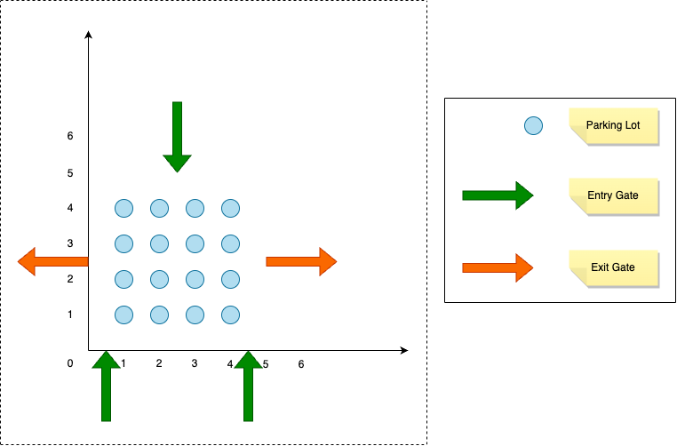

# ParkingLotLLD

## Problem Statement
> TODO ::: Explain the problem statement

## Example Configuration
> The below is the default configuration used for testing the functionality of the parking lot

## Architecture
> TODO ::: Add a high-level architecture involving all the components

## Working
### Assumptions
### Algorithm
### Time-complexity analysis

