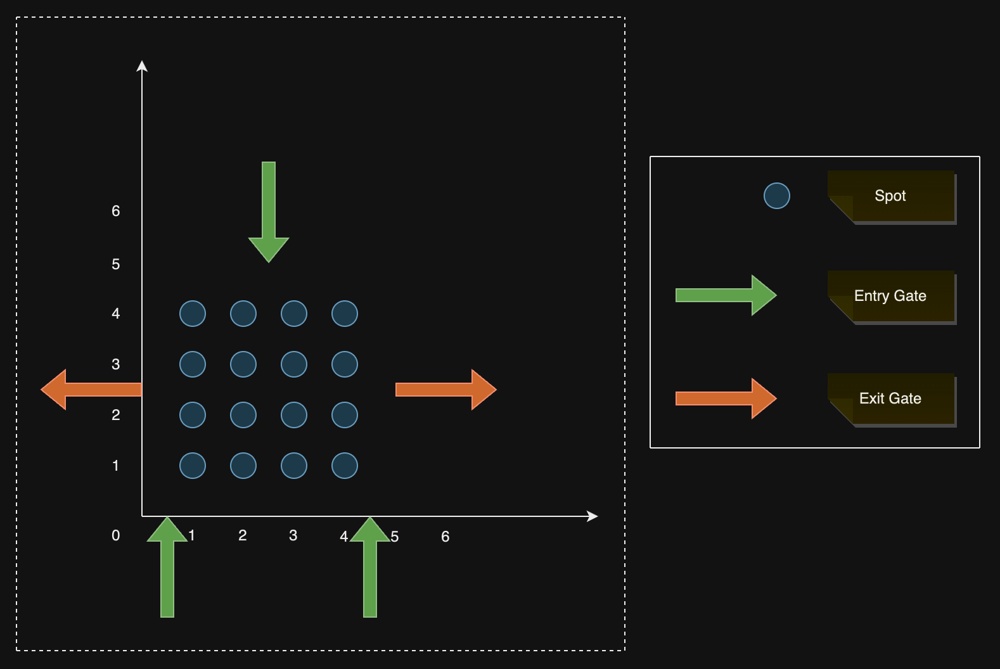

# ParkingLotLLD

## Problem Statement
- Design a software which efficiently allots a spot in the parkinglot for the entering vehicles.
- The system must support parallellism ie., it should function correctly when multiple vehicles enter and exit simultaneously.

## Example Configuration
> The below is the default configuration used for testing the functionality of the parking lot

## Architecture
> TODO ::: Add a high-level architecture involving all the components

## Working
### Assumptions
- All the vehicles will follow a queue approach at each gate while entering/exiting. However two vehicles can enter/exit different gates simultaneously.
- When a vehicle enters a gate after getting allotted with a spot, it will always park in it's allotted spot.
- When a vehicle leaves its spot, it will immediately attempt to exit via an exit-gate.
- The spot is made available only after the vehicle exits via an exit-gate
- When all the spots are occupied, the entering vehicles have to wait untill one of the parked vehicle exits

### Algorithm
- When a vehicle enters/exits, a WorkerThread(T) from the ThreadPool is trigeered along with required parameters loaded in it.
- If the parameters contain an **EntryGateId**, the operation will be **OCCUPY**. Else if the parameters contain a **spotId**, the operation will be **VACATE**.
#### OCCUPY
- Get the WorkerResource mapped to the EntryGateId and a WorkerResource has the following
- - lock
- - optimalSpot    [The optimal spot as per the current configuration]
- - selectionOrder [A bitset for the spots, sorted based on euclidean distances from the entry-gate this WorkerResource is allot to]
- - messageQueue   
- If the WorkerResource is locked, wait till the resource is available. Otherwise, acquire the lock on WorkerResource.
- The messageQueue is not empty, read all the broadCastMessages in it and update the spot states in the selectionOrder.
- The optimalSpot is set to the first element in the selectionOrder initially. And it gets auto-updated when a broadCastMessage is read.
- Notify all WorkerResources that optimalSpot is occupied [We'll use BroadcastService, which adds a broadcastMessage into messageQueues of all the WorkerResources]
- Release the lock on this WorkerResource
- Invoke the TicketingService which provides a ticket containing the spot details the vehicle should park at. 
- Reset the thread and add it back to the ThreadPool
#### VACATE
- Get the spot data this vehicle is vacating
- Notify all WorkerResources that the spot is vacated [We'll use BroadcastService, which adds a broadcastMessage into messageQueues of all the WorkerResources]
- Invoke the TicketingService to update the ticket that it's expired.
- Reset the thread and add it back to the ThreadPool

### Performance analysis
- The performance depends on the number of threads in the threadpool, and it's defaulted to **(NumberOfEntryGates+NumberOfExitGates)**
- Assuming the defaults, below are the time-complexities
- - **OCCUPY**    : O(LengthOfWorkerResourceMessageQueue) --> O(1)
- - **VACATE**    : O(LengthOfWorkerResourceMessageQueue) --> O(1)
- - **BROADCAST** : O(NumberOfEntryGates)                 --> O(1)
- We can conclude that it's a high-performace system due to the constant time-complexities for any operation.

### Limitations and FutureScope
- Currently, the system supports only a single type of vehicles. However, we can develop it to support multiple vehicle types as well.
- We can use redis-cache to store all the configurations and use it to persist the system state
- Currently, the **parking-cli** is very limited and it can be further developed to support more complex operations as well.
- As an extension to the above point, we can also add an HTTP Layer(With the help of Servlet or Spring Framework) and develop a web-portal, which can be used by the parkinglot administrator to customise and monitor the parkinglot accordingly.
- We can add a NotificationService, which can be utilised by the TicketingService to send a whatsapp message or an SMS containing the spot details for the vehicle to be parked at.

